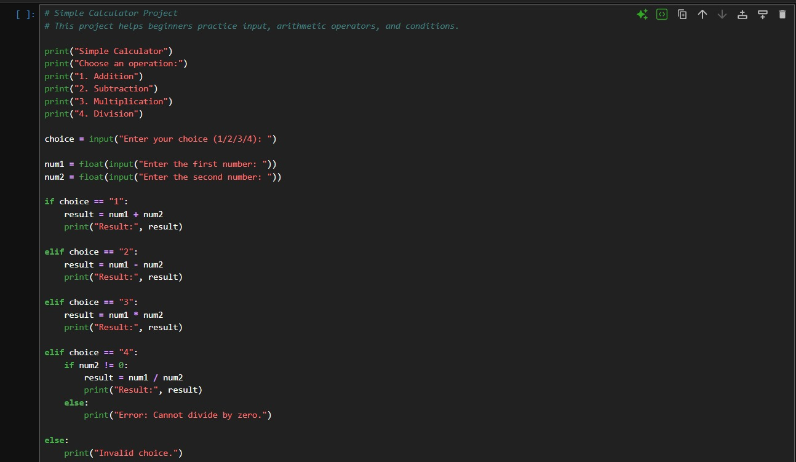

# Simple Calculator

## Overview

Simple Calculator is a beginner-friendly Python project designed to teach kids and young learners how to use input, arithmetic operators, and conditional statements.

## What the Program Does

The user chooses an arithmetic operation and enters two numbers.  
The program then calculates and displays the result.

The calculator supports:

- Addition
- Subtraction
- Multiplication
- Division

## Learning Objectives

By completing this project, students will learn:

- How to take input from the user
- How to convert input into numbers
- How to use arithmetic operators
- How to use if / elif / else
- How to handle division by zero
- How to build simple interactive programs

## Concepts Covered

- input()
- float()
- if / elif / else
- Arithmetic operators
- Basic error handling
- User interaction

## How to Run

```bash
python calculator.py
```

## Example Output

```text
Simple Calculator
Choose an operation:
1. Addition
2. Subtraction
3. Multiplication
4. Division
Enter your choice (1/2/3/4): 1
Enter the first number: 10
Enter the second number: 5
Result: 15.0
```

## Code Screenshot



## Output Screenshot


## Teaching Notes

This project is suitable for kids and beginners because it connects programming with basic math operations that students already understand.

It can be used to explain how programs receive input, process data, and display output.

## Possible Improvements

- Repeat the calculator until the user chooses to exit
- Add more operations such as power and modulus
- Improve input validation
- Create a simple menu system
