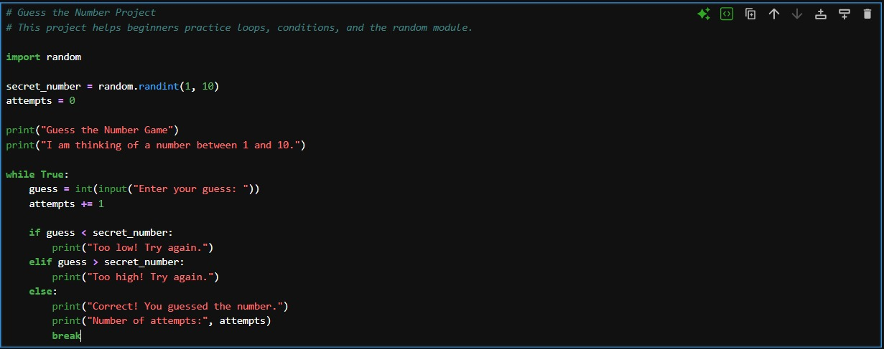
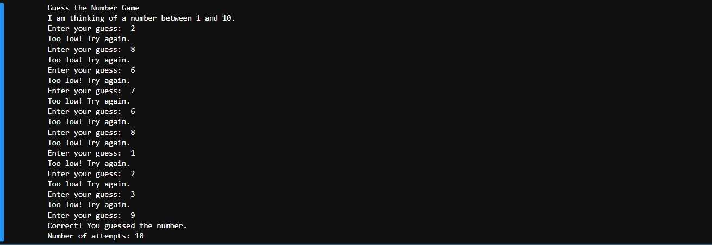

# Guess the Number

## Overview

Guess the Number is a beginner-friendly Python game designed to teach kids and young learners how to use loops, conditions, and the random module.

## What the Program Does

The computer chooses a random number between 1 and 10.  
The user keeps guessing until they find the correct number.

The program gives hints such as:

- Too low
- Too high
- Correct answer

## Learning Objectives

By completing this project, students will learn:

- How to use the random module
- How to generate random numbers
- How to use while loops
- How to use if / elif / else
- How to count attempts
- How to build simple game logic

## Concepts Covered

- import random
- random.randint()
- while True
- input()
- int()
- if / elif / else
- break
- Counter variable

## How to Run

```bash
python guess_number.py
```

## Example Output

```text
Guess the Number Game
I am thinking of a number between 1 and 10.
Enter your guess: 5
Too low! Try again.
Enter your guess: 8
Correct! You guessed the number.
Number of attempts: 2
```

## Code Screenshot



## Output Screenshot



## Teaching Notes

This project is suitable for kids because it turns programming concepts into a simple interactive game.

It can be used to explain loops, decision-making, and how computers can generate random values.

## Possible Improvements

- Let the user choose the number range
- Limit the number of attempts
- Add difficulty levels
- Add a play again option
