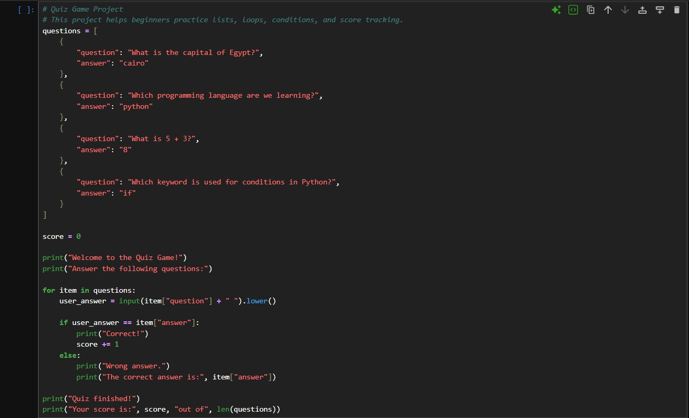
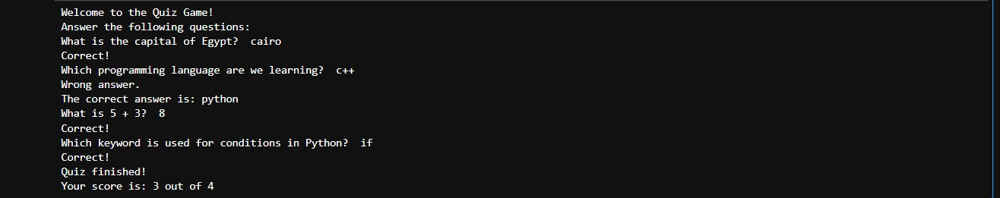

# Quiz Game

## Overview

Quiz Game is a beginner-friendly Python project designed to teach kids and young learners how to use lists, loops, conditions, and scoring systems.

## What the Program Does

The program asks the user a set of questions.  
The user enters answers, and the program checks whether each answer is correct or wrong.

At the end, the program displays the final score.

## Learning Objectives

By completing this project, students will learn:

- How to store multiple questions
- How to use lists
- How to use dictionaries
- How to use loops
- How to compare user answers
- How to create a score system
- How to build a simple interactive quiz

## Concepts Covered

- Lists
- Dictionaries
- for loop
- input()
- lower()
- if / else
- Score counter
- len()

## How to Run

```bash
python quiz_game.py
```

## Example Output

```text
Welcome to the Quiz Game!
Answer the following questions:
What is the capital of Egypt? cairo
Correct!
Which programming language are we learning? python
Correct!
What is 5 + 3? 8
Correct!
Which keyword is used for conditions in Python? if
Correct!
Quiz finished!
Your score is: 4 out of 4
```

## Code Screenshot



## Output Screenshot



## Teaching Notes

This project is suitable for kids because it turns programming practice into an interactive question-and-answer activity.

It can be used to explain how data can be stored, repeated, checked, and scored in a simple program.

## Possible Improvements

- Add more questions
- Add multiple-choice answers
- Add difficulty levels
- Randomize the questions
- Show percentage score
