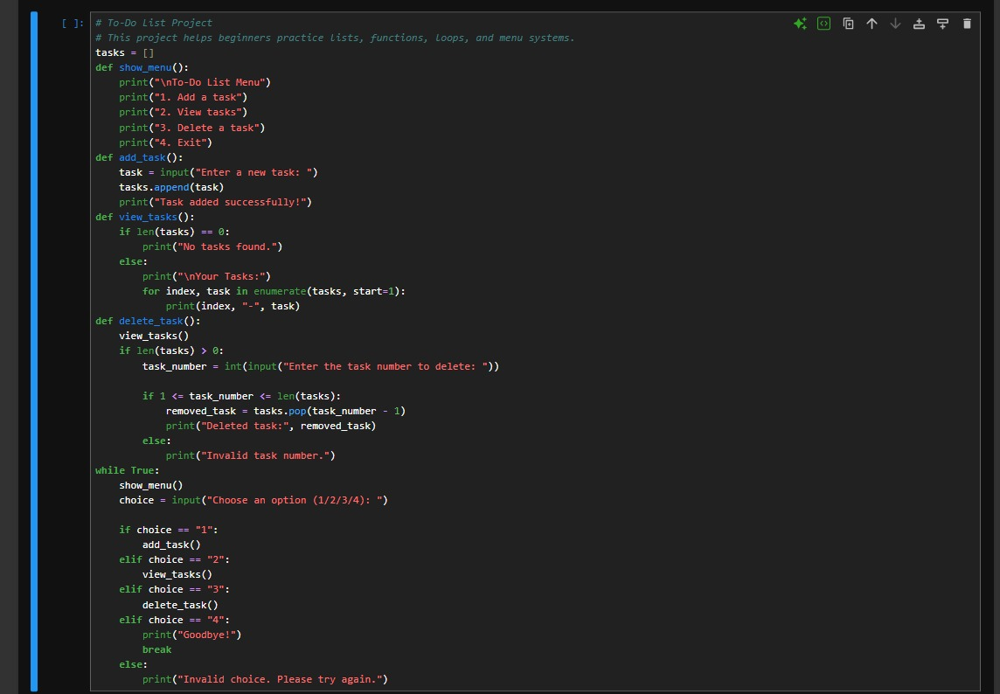
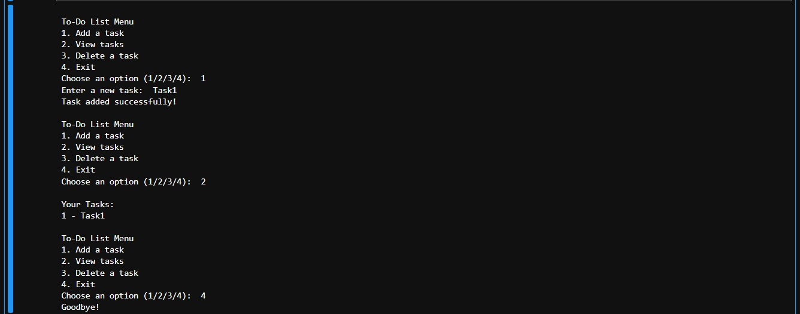

# To-Do List

## Overview

To-Do List is a beginner-friendly Python project designed to teach kids and young learners how to use lists, functions, loops, and menu systems.

## What the Program Does

The program allows the user to manage a simple list of tasks.

The user can:

- Add a new task
- View all tasks
- Delete a task
- Exit the program

## Learning Objectives

By completing this project, students will learn:

- How to use lists to store data
- How to create and call functions
- How to use while loops
- How to create a menu system
- How to add items to a list
- How to delete items from a list
- How to use basic program structure

## Concepts Covered

- Lists
- Functions
- while loop
- if / elif / else
- append()
- pop()
- len()
- enumerate()
- User input
- Menu system

## How to Run

```bash
python to_do_list.py
```

## Example Output

```text
To-Do List Menu
1. Add a task
2. View tasks
3. Delete a task
4. Exit
Choose an option (1/2/3/4): 1
Enter a new task: Study Python
Task added successfully!

To-Do List Menu
1. Add a task
2. View tasks
3. Delete a task
4. Exit
Choose an option (1/2/3/4): 2

Your Tasks:
1 - Study Python
```

## Code Screenshot



## Output Screenshot



## Teaching Notes

This project is suitable for kids and beginners because it introduces the idea of building a small real-life application.

It can be used to explain how programs store information, organize actions into functions, and allow users to interact with a menu.

## Possible Improvements

- Save tasks to a file
- Mark tasks as completed
- Add task priority
- Add task due dates
- Improve input validation
